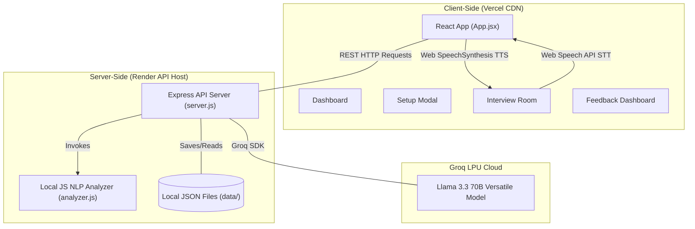

<p align="center">
  
</p>

<h1 align="center">AI Interview Preparation Assistant</h1>

<p align="center">
  <strong>An immersive, ultra-responsive mock interview coaching platform designed to help candidates master technical, behavioral, and system design communication skills.</strong>
</p>

<p align="center">
  <a href="https://ai-interview-preparation-assistant-two.vercel.app/" target="_blank">
    
  </a>
</p>

<p align="center">
  
  &nbsp;
  
  &nbsp;
  
</p>

---

## 🏗️ End-to-End System Architecture

The application is structured into a modular monorepo containing a high-performance **React frontend client** built using Vite and a stateless **Node.js Express backend API** server. AI evaluations are powered by the **Groq LPU Inference Engine** using the **Llama 3.3 70B** reasoning model, while speech analytics are processed locally in JavaScript.



### Data & Evaluation Flow
1. **Setup**: The candidate customizes their target role, difficulty level, interview type, and target job description. The frontend issues a `POST /api/sessions` call.
2. **Question Generation**: The backend server calls Groq to generate a context-aware initial question using Llama 3.3 70B. The session is saved locally as JSON and returned.
3. **Dialogue Room**: The client reads the question aloud using the browser's native **Speech Synthesis API**. The user records their reply via the browser's native **Speech Recognition API** (Web Speech API) or edits transcripts manually.
4. **Answer Evaluation**: Submitting the answer triggers `POST /api/sessions/:id/answer`. The backend performs two parallel actions:
   * **Static NLP Analytics**: Evaluates filler word density, pace (words per minute), lexical diversity (Type-Token Ratio), sentence structure, and tone confidence indices locally in JavaScript.
   * **Llama 3.3 70B Evaluation**: Instructs the Groq LPU engine (in JSON mode) to grade the response quality, list strengths/weaknesses, write a model STAR-method answer, and generate the next interview question.
5. **Grading & Reporting**: After completing all questions (or choosing to exit early), the user triggers `POST /api/sessions/:id/end`. Llama 3.3 70B compiles an overall report outlining key strengths, weaknesses, and a structured, actionable preparation roadmap.

---

## 🌟 Core Features

* **Custom Mock Configurations**: Tailor sessions to custom roles (e.g. Intern Software Engineer, Principal SRE), difficulty levels, interview categories (Behavioral, Technical, System Design, HR), and custom Job Descriptions.
* **Interactive Voice Room**: Hands-free practice with automatic voice synthesis reading out questions and speech recognition transcribing user answers. Includes dynamic visual CSS waveform representations for mic states.
* **Speech & Text Analytics**:
  * **Filler Words Tracker**: Counts and tags occurrences of words like `"um"`, `"like"`, `"basically"`, `"actually"`, `"you know"`, and `"so"`.
  * **Pacing Metrics**: Estimates speaking pace based on target word speeds.
  * **Vocabulary Diversity**: Calculates lexical richness (Type-Token Ratio) to track repetitive phrasing.
  * **Confidence Tone Index**: Evaluates tone based on strong action verbs (e.g. `led`, `optimized`, `spearheaded`) vs anxious/hesitant terms (e.g. `probably`, `unsure`, `dont know`).
  * **Readability Index**: Checks average sentence length to avoid run-on or choppy sentences.
* **Granular AI Evaluations**: Review overall score progress rings (custom SVG) alongside individual question tabs showing targeted growth feedback and recommended model answers.
* **History Tracker**: Lists and manages previous mock sessions and grading scores.

---

## 🛠️ File Structure

```
ai-interview-assistant/
├── backend/
│   ├── .env                       # Backend Groq API Key configuration
│   ├── analyzer.js                # Speech NLP and communication analytics parser
│   ├── package.json               # Server dependencies (Express, CORS, Groq SDK)
│   ├── server.js                  # Express API routes, session manager, and JSON DB coordinator
│   └── data/                      # JSON files containing session history (local)
├── frontend/
│   ├── index.html                 # Font styles and HTML skeleton
│   ├── package.json               # React UI dependencies
│   ├── vercel.json                # API Rewrite rule redirecting /api/* calls to Render
│   ├── vite.config.js             # Proxies all client requests to localhost:5001 during dev
│   ├── public/
│   │   └── logo.png               # Centered repository header asset
│   └── src/
│       ├── main.jsx
│       ├── index.css              # Custom Vanilla CSS design system (Glassmorphism layout)
│       ├── App.jsx                # Main coordinator component and layout views
│       └── components/
│           ├── Dashboard.jsx      # Overall stats overview and history list
│           ├── SetupModal.jsx     # Dropdown panels to configure new interviews
│           ├── InterviewRoom.jsx  # STT / TTS recording modules and chat log
│           ├── FeedbackReport.jsx # Overall metrics dashboards and study roadmap
│           ├── CircularProgress.jsx # Animated circular progress gauge components
│           └── AudioVisualizer.jsx  # Waveform simulators for mic/speaking indicators
└── run.bat                        # Launcher script to boot both servers in separate windows locally
```

---

## 🚀 Setup & Launch Instructions

### Prerequisites
* **Node.js** (v18+ recommended)
* A **Groq API Key** from [Groq Console](https://console.groq.com/keys)

### 1. Configure the API Key
Navigate to `backend/.env` and paste your key:
```env
GROQ_API_KEY=gsk_...
```
*(The server reads this environment variable to authenticate requests with Groq's LPU engine).*

### 2. Launch the Application Locally
At the root of the project directory, double-click **`run.bat`** (on Windows). 
This launcher script automatically opens two separate command prompt windows to boot:
* **Express Server** on [http://localhost:5001](http://localhost:5001)
* **Vite Frontend Client** on [http://localhost:5173](http://localhost:5173)

Open your browser to **[http://localhost:5173/](http://localhost:5173/)** and start practicing!

---

## 🔒 Security & Privacy
* Your API key is stored locally in your backend's environment variables (`.env`) or securely on your Render.com variables.
* Interview histories are saved locally as `.json` files in the `backend/data/` folder. No third-party databases are used, ensuring your mock interview answers stay private.
