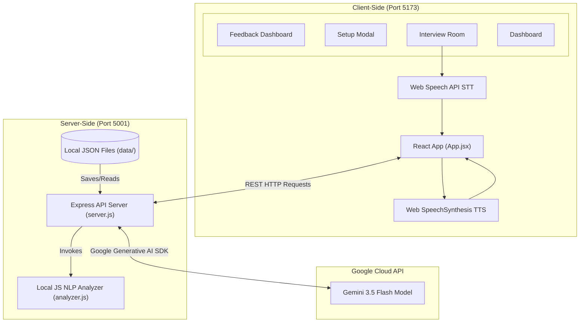

# AI Interview Preparation Assistant

An immersive, AI-powered mock interview coaching platform that helps job seekers practice and refine their technical, behavioral, and system design communication skills. The application generates adaptive interview questions matching specific jobs, records response transcripts, and offers immediate analytical communication feedback alongside content scores powered by Google's Gemini 3.5 Flash model.

---

## 🏗️ End-to-End System Architecture

The application consists of a **React frontend** built with **Vite**, a **Node.js + Express backend**, and **Google Gemini 3.5 Flash** for AI-powered interview evaluation.



### Data & Execution Flow
1. **Setup**: The candidate selects their target role, difficulty level, interview type, and pastes a job description. The frontend sends this to `POST /api/sessions`.
2. **Question Generation**: The backend server interfaces with Gemini 3.5 Flash to generate a custom, context-aware initial question. The session status is saved in a local JSON file under `backend/data/` and returned to the client.
3. **Dialogue Room**: The client reads the question aloud using the browser's native **Speech Synthesis API**. The user records their reply via the browser's native **Speech Recognition API** (Web Speech API) or type their edit in the editor.
4. **Answer Evaluation**: Submitting the answer triggers `POST /api/sessions/:id/answer`. The backend performs two parallel actions:
   * **Static NLP Analytics**: Evaluates filler word density, pace (words per minute), lexical diversity (Type-Token Ratio), sentence structure, and tone confidence indices locally in JavaScript.
   * **Gemini Evaluation**: Instructs Gemini (using `responseMimeType: "application/json"`) to grade the response quality, list strengths/weaknesses, write a model STAR-method answer, and generate the next interview question.
5. **Grading & Reporting**: After completing all questions (or choosing to exit early), the user triggers `POST /api/sessions/:id/end`. Gemini compiles an overall report outlining key strengths, overall weaknesses, and a structured, actionable preparation roadmap.

---

## 🌟 Core Features

* **Custom Mock Configurations**: Tailor sessions to custom roles (e.g. Intern Software Engineer, Principal SRE), difficulty levels, interview categories (Behavioral, Technical, System Design, HR), and custom Job Descriptions.
* **Interactive Voice Room**: Hands-free practice with automatic voice synthesis reading out questions and speech recognition transcribing user answers. Includes dynamic visual CSS waveform representations for mic states.
* **Speech & Text Analytics**:
  * **Filler Words Tracker**: Counts and tags occurrences of words like `"um"`, `"like"`, `"basically"`, `"actually"`, `"you know"`, and `"so"`.
  * **Pacing Metrics**: Estimates speaking pace based on target word speeds.
  * **Vocabulary Diversity**: Calculates lexical richness (Type-Token Ratio) to track repetitive phrasing.
  * **Confidence Tone Index**: Evaluates tone based on strong action verbs (e.g. `led`, `optimized`, `spearheaded`) vs anxious/hesitant terms (e.g. `probably`, `unsure`, `dont know`).
  * **Readability Index**: Checks average sentence length to avoid run-on or choppy sentences.
* **Granular AI Evaluations**: Review overall score progress rings (custom SVG) alongside individual question tabs showing targeted growth feedback and recommended model answers.
* **History Tracker**: Lists and manages previous mock sessions and grading scores.

---

## 🛠️ File Structure

```
ai-interview-assistant/
├── backend/
│   ├── .env                       # Backend Gemini API Key configuration
│   ├── analyzer.js                # Speech NLP and communication analytics parser
│   ├── package.json               # Server dependencies (Express, CORS, Generative AI SDK)
│   ├── server.js                  # Express API routes, session manager, and JSON DB coordinator
│   └── data/                      # JSON files containing session history (auto-generated)
├── frontend/
│   ├── index.html                 # Font styles and HTML skeleton
│   ├── package.json               # React UI dependencies
│   ├── vite.config.js             # Proxies all client requests to localhost:5001
│   └── src/
│       ├── main.jsx
│       ├── index.css              # Custom Vanila CSS design system (Glassmorphism layout)
│       ├── App.jsx                # Main coordinator component and layout views
│       └── components/
│           ├── Dashboard.jsx      # Overall stats overview and history list
│           ├── SetupModal.jsx     # Dropdown panels to configure new interviews
│           ├── InterviewRoom.jsx  # STT / TTS recording modules and chat log
│           ├── FeedbackReport.jsx # Overall metrics dashboards and study roadmap
│           ├── CircularProgress.jsx # Animated circular progress gauge components
│           └── AudioVisualizer.jsx  # Waveform simulators for mic/speaking indicators
└── run.bat                        # Launcher script to boot both servers in separate windows
```

---

## 🚀 Setup & Launch Instructions

### Prerequisites
* **Node.js** (v18+ recommended)
* A **Gemini API Key** from [Google AI Studio](https://aistudio.google.com/)

### 1. Configure the API Key
Navigate to `backend/.env` and paste your key:
```env
GEMINI_API_KEY=API
```
*(The server reads this environment variable to authenticate requests with Google's API).*

### 2. Launch the Application
At the root of the project directory, double-click **`run.bat`** (on Windows). 
This launcher script automatically opens two separate command prompt windows to boot:
* **Express Server** on [http://localhost:5001](http://localhost:5001)
* **Vite Frontend Client** on [http://localhost:5173](http://localhost:5173)

Open your browser to **[http://localhost:5173/](http://localhost:5173/)** and start practicing!

---

## 🔒 Security & Privacy
* Your API key is stored locally in your backend's environment variables (`.env`).
* Interview histories are saved locally as `.json` files in the `backend/data/` folder. No third-party databases are used, ensuring your mock interview answers stay private to your local computer.
